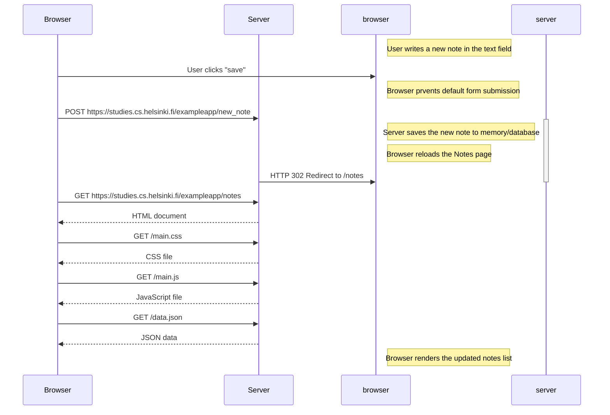

## Sequence Diagram – Loading a Web Page

```mermaid
sequenceDiagram
    participant Browser
    participant Server

    Note right of browser:User writes a new note in the text field


    Browser->>browser:User clicks "save"
    Note right of browser:Browser prvents default form submission
    Browser->>Server:POST https://studies.cs.helsinki.fi/exampleapp/new_note
    activate server
    
    Note left of server: Server saves the new note to memory/database
    
    Note right of browser: Browser reloads the Notes page


    Server->>browser: HTTP 302 Redirect to /notes
    deactivate server

    Browser->>Server:  GET https://studies.cs.helsinki.fi/exampleapp/notes
    Server-->>Browser: HTML document

    Browser->>Server: GET /main.css
    Server-->>Browser: CSS file

    Browser->>Server: GET /main.js
    Server-->>Browser: JavaScript file

    Browser->>Server: GET /data.json
    Server-->>Browser: JSON data

    Note right of browser: Browser renders the updated notes list


```

